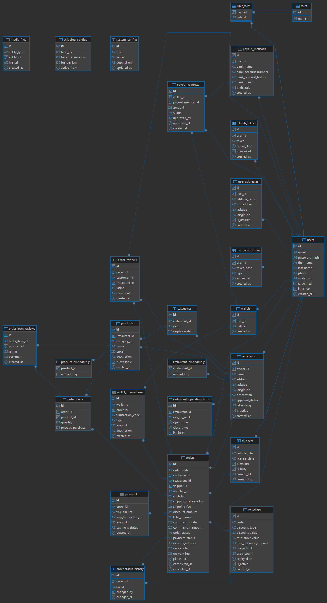

# Tài liệu Thiết kế Database - Food Delivery Platform

## 1. Tổng quan thiết kế

### 1.1 Hệ quản trị cơ sở dữ liệu
- **DBMS**: PostgreSQL (phiên bản 12+)
- **Mô hình**: Relational Database
- **Extension**: pgvector (cho tìm kiếm semantic AI-powered)

### 1.2 Chuẩn hóa
Database được thiết kế theo **Third Normal Form (3NF)** nhằm:
- Giảm thiểu dư thừa dữ liệu
- Đảm bảo tính toàn vẹn tham chiếu
- Tối ưu hiệu suất truy vấn

### 1.3 Migration Tool
- Khuyến nghị sử dụng: **Flyway** hoặc **Liquibase**
- Hoặc JPA/Hibernate với `spring.jpa.hibernate.ddl-auto=validate`

### 1.4 Phạm vi hệ thống
Database phục vụ cho một nền tảng giao đồ ăn với các chức năng:
- Quản lý người dùng, nhà hàng, sản phẩm
- Xử lý đơn hàng và giao hàng
- Thanh toán và ví điện tử
- Đánh giá và review
- Tìm kiếm thông minh bằng AI (semantic search)

---

## 2. Entity Relationship Diagram (ERD)

### 2.1 Sơ đồ tổng quan



### 2.2 Mô tả quan hệ chính
- **Users** là trung tâm, có thể là customer, restaurant owner, hoặc shipper
- **Restaurants** thuộc về một owner (user)
- **Products** thuộc về restaurant và category
- **Orders** liên kết customer, restaurant, shipper, và voucher
- **Wallets** quản lý số dư và giao dịch của từng user
- **AI Embeddings** lưu vector representation cho semantic search

---

## 3. Danh sách bảng và mô tả chức năng

### 3.1 Nhóm Users & Authorization

#### 3.1.1 `users`
**Chức năng**: Lưu thông tin tất cả người dùng trong hệ thống (customer, restaurant owner, shipper, admin)

| Column | Type | Description |
|--------|------|-------------|
| id | UUID | Primary key |
| email | VARCHAR(255) | Email đăng nhập (unique) |
| password_hash | VARCHAR(255) | Mật khẩu đã hash |
| first_name | VARCHAR(50) | Tên |
| last_name | VARCHAR(50) | Họ |
| phone | VARCHAR(20) | Số điện thoại (unique) |
| avatar_url | TEXT | Link ảnh đại diện |
| is_verified | BOOLEAN | Đã xác thực email chưa |
| is_active | BOOLEAN | Tài khoản còn hoạt động không |
| created_at | TIMESTAMPTZ | Thời gian tạo |

**Quan hệ**:
- 1:n với `orders` (customer_id)
- 1:n với `restaurants` (owner_id)
- 1:1 với `shippers`
- 1:n với `user_addresses`
- 1:1 với `wallets`

#### 3.1.2 `user_addresses`
**Chức năng**: Lưu nhiều địa chỉ giao hàng của người dùng (nhà riêng, công ty, ...)

| Column | Type | Description |
|--------|------|-------------|
| id | UUID | Primary key |
| user_id | UUID | FK → users.id |
| address_name | VARCHAR(50) | Tên gọi (vd: "Nhà riêng") |
| full_address | TEXT | Địa chỉ chi tiết |
| latitude | NUMERIC(10,8) | Vĩ độ |
| longitude | NUMERIC(11,8) | Kinh độ |
| is_default | BOOLEAN | Địa chỉ mặc định |
| created_at | TIMESTAMPTZ | Thời gian tạo |

**Ràng buộc đặc biệt**: Mỗi user chỉ có **1 địa chỉ mặc định** (unique index with WHERE clause)

#### 3.1.3 `roles`
**Chức năng**: Định nghĩa các vai trò trong hệ thống

| Column | Type | Description |
|--------|------|-------------|
| id | SERIAL | Primary key |
| name | VARCHAR(30) | Tên role (CUSTOMER, RESTAURANT_OWNER, SHIPPER, ADMIN) |

#### 3.1.4 `user_roles`
**Chức năng**: Bảng trung gian many-to-many giữa users và roles

| Column | Type | Description |
|--------|------|-------------|
| user_id | UUID | FK → users.id |
| role_id | INT | FK → roles.id |

**Primary Key**: Composite key (user_id, role_id)

#### 3.1.5 `refresh_tokens`
**Chức năng**: Quản lý JWT refresh tokens

| Column | Type | Description |
|--------|------|-------------|
| id | UUID | Primary key |
| user_id | UUID | FK → users.id |
| token | TEXT | Refresh token (unique) |
| expiry_date | TIMESTAMPTZ | Thời gian hết hạn |
| is_revoked | BOOLEAN | Token đã bị thu hồi chưa |
| created_at | TIMESTAMPTZ | Thời gian tạo |

#### 3.1.6 `user_verifications`
**Chức năng**: Quản lý token xác thực email và reset password

| Column | Type | Description |
|--------|------|-------------|
| id | UUID | Primary key |
| user_id | UUID | FK → users.id |
| token_hash | TEXT | Token đã hash |
| type | VARCHAR(20) | EMAIL_VERIFY hoặc PASSWORD_RESET |
| expires_at | TIMESTAMPTZ | Thời gian hết hạn |
| created_at | TIMESTAMPTZ | Thời gian tạo |

---

### 3.2 Nhóm Restaurants & Products

#### 3.2.1 `restaurants`
**Chức năng**: Lưu thông tin nhà hàng/quán ăn

| Column | Type | Description |
|--------|------|-------------|
| id | UUID | Primary key |
| owner_id | UUID | FK → users.id (chủ quán) |
| name | VARCHAR(255) | Tên nhà hàng |
| address | TEXT | Địa chỉ |
| latitude | NUMERIC(10,8) | Vĩ độ |
| longitude | NUMERIC(11,8) | Kinh độ |
| description | TEXT | Mô tả |
| approval_status | VARCHAR(20) | PENDING, APPROVED, REJECTED |
| rating_avg | NUMERIC(2,1) | Điểm đánh giá trung bình (0-5) |
| is_active | BOOLEAN | Đang hoạt động |
| created_at | TIMESTAMPTZ | Thời gian tạo |

**Quan hệ**:
- n:1 với `users` (owner)
- 1:n với `products`
- 1:n với `categories`
- 1:n với `orders`

#### 3.2.2 `restaurant_operating_hours`
**Chức năng**: Lưu giờ hoạt động của nhà hàng theo từng ngày trong tuần

| Column | Type | Description |
|--------|------|-------------|
| id | SERIAL | Primary key |
| restaurant_id | UUID | FK → restaurants.id |
| day_of_week | INT | 0=CN, 1=T2, ..., 6=T7 |
| open_time | TIME | Giờ mở cửa |
| close_time | TIME | Giờ đóng cửa |
| is_closed | BOOLEAN | Nghỉ cả ngày |

#### 3.2.3 `categories`
**Chức năng**: Phân loại món ăn trong menu nhà hàng (Món chính, Tráng miệng, Đồ uống,...)

| Column | Type | Description |
|--------|------|-------------|
| id | SERIAL | Primary key |
| restaurant_id | UUID | FK → restaurants.id |
| name | VARCHAR(100) | Tên danh mục |
| display_order | INT | Thứ tự hiển thị |

#### 3.2.4 `products`
**Chức năng**: Lưu thông tin món ăn/sản phẩm

| Column | Type | Description |
|--------|------|-------------|
| id | UUID | Primary key |
| restaurant_id | UUID | FK → restaurants.id |
| category_id | INT | FK → categories.id |
| name | VARCHAR(255) | Tên món |
| price | NUMERIC(12,2) | Giá (>= 0) |
| description | TEXT | Mô tả |
| is_available | BOOLEAN | Còn hàng |
| created_at | TIMESTAMPTZ | Thời gian tạo |

**Quan hệ**:
- n:1 với `restaurants`
- n:1 với `categories`
- 1:n với `order_items`

---

### 3.3 Nhóm Shipping

#### 3.3.1 `shippers`
**Chức năng**: Thông tin tài xế giao hàng (mở rộng từ users)

| Column | Type | Description |
|--------|------|-------------|
| id | UUID | PK & FK → users.id |
| vehicle_info | VARCHAR(100) | Thông tin phương tiện |
| license_plate | VARCHAR(20) | Biển số xe (unique) |
| is_online | BOOLEAN | Đang online |
| is_busy | BOOLEAN | Đang giao hàng |
| current_lat | NUMERIC(10,8) | Vị trí hiện tại - vĩ độ |
| current_lng | NUMERIC(11,8) | Vị trí hiện tại - kinh độ |

**Đặc điểm**: Kế thừa từ `users` (1:1 relationship)

#### 3.3.2 `shipping_configs`
**Chức năng**: Cấu hình phí ship theo thời gian (có thể thay đổi)

| Column | Type | Description |
|--------|------|-------------|
| id | SERIAL | Primary key |
| base_fee | NUMERIC(12,2) | Phí cơ bản |
| base_distance_km | NUMERIC(5,2) | Khoảng cách cơ bản (km) |
| fee_per_km | NUMERIC(12,2) | Phí mỗi km vượt |
| active_from | TIMESTAMPTZ | Áp dụng từ ngày |

**Note**: Lưu historical data để track thay đổi giá theo thời gian

---

### 3.4 Nhóm Promotion & System Config

#### 3.4.1 `vouchers`
**Chức năng**: Quản lý mã giảm giá

| Column | Type | Description |
|--------|------|-------------|
| id | UUID | Primary key |
| code | VARCHAR(50) | Mã voucher (unique) |
| discount_type | VARCHAR(20) | PERCENTAGE hoặc FIXED_AMOUNT |
| discount_value | NUMERIC(12,2) | Giá trị giảm |
| min_order_value | NUMERIC(12,2) | Giá trị đơn hàng tối thiểu |
| max_discount_amount | NUMERIC(12,2) | Giảm tối đa (cho % discount) |
| usage_limit | INT | Số lần sử dụng tối đa |
| used_count | INT | Đã sử dụng bao nhiêu lần |
| expiry_date | TIMESTAMPTZ | Ngày hết hạn |
| is_active | BOOLEAN | Còn hoạt động |
| created_at | TIMESTAMPTZ | Thời gian tạo |

#### 3.4.2 `system_configs`
**Chức năng**: Lưu các thông số cấu hình hệ thống (commission rate, min order value,...)

| Column | Type | Description |
|--------|------|-------------|
| id | SERIAL | Primary key |
| key | VARCHAR(50) | Tên config (unique) |
| value | NUMERIC(10,2) | Giá trị |
| description | TEXT | Mô tả |
| updated_at | TIMESTAMPTZ | Lần cập nhật cuối |

---

### 3.5 Nhóm Orders

#### 3.5.1 `orders`
**Chức năng**: Lưu thông tin đơn hàng - **bảng trung tâm nhất của hệ thống**

| Column | Type | Description |
|--------|------|-------------|
| id | UUID | Primary key |
| order_code | VARCHAR(20) | Mã đơn hàng (unique, human-readable) |
| customer_id | UUID | FK → users.id |
| restaurant_id | UUID | FK → restaurants.id |
| shipper_id | UUID | FK → shippers.id |
| voucher_id | UUID | FK → vouchers.id |
| subtotal | NUMERIC(12,2) | Tổng tiền món ăn (>= 0) |
| shipping_distance_km | NUMERIC(6,2) | Khoảng cách giao hàng |
| shipping_fee | NUMERIC(12,2) | Phí ship (>= 0) |
| discount_amount | NUMERIC(12,2) | Số tiền giảm giá (>= 0) |
| total_amount | NUMERIC(12,2) | Tổng thanh toán (>= 0) |
| commission_rate | NUMERIC(5,2) | % hoa hồng sàn (>= 0) |
| commission_amount | NUMERIC(12,2) | Số tiền hoa hồng (>= 0) |
| order_status | VARCHAR(30) | PENDING, CONFIRMED, SHIPPING, COMPLETED, CANCELLED |
| payment_status | VARCHAR(30) | UNPAID, PAID, REFUNDED |
| delivery_address | TEXT | Địa chỉ giao hàng |
| delivery_lat | NUMERIC(10,8) | Vĩ độ giao hàng |
| delivery_lng | NUMERIC(11,8) | Kinh độ giao hàng |
| placed_at | TIMESTAMPTZ | Thời gian đặt |
| completed_at | TIMESTAMPTZ | Thời gian hoàn thành |
| cancelled_at | TIMESTAMPTZ | Thời gian hủy |

**Đặc điểm**: Snapshot pattern - lưu lại giá, phí ship, commission tại thời điểm đặt hàng

#### 3.5.2 `order_items`
**Chức năng**: Chi tiết món ăn trong đơn hàng

| Column | Type | Description |
|--------|------|-------------|
| id | SERIAL | Primary key |
| order_id | UUID | FK → orders.id |
| product_id | UUID | FK → products.id |
| quantity | INT | Số lượng (> 0) |
| price_at_purchase | NUMERIC(12,2) | Giá tại thời điểm mua |

**Đặc điểm**: Lưu `price_at_purchase` để tránh bị ảnh hưởng khi nhà hàng thay đổi giá

#### 3.5.3 `order_status_history`
**Chức năng**: Lịch sử thay đổi trạng thái đơn hàng (audit log)

| Column | Type | Description |
|--------|------|-------------|
| id | SERIAL | Primary key |
| order_id | UUID | FK → orders.id |
| status | VARCHAR(30) | Trạng thái mới |
| changed_by | UUID | FK → users.id (người thay đổi) |
| changed_at | TIMESTAMPTZ | Thời gian thay đổi |

---

### 3.6 Nhóm Payments & Wallet

#### 3.6.1 `payments`
**Chức năng**: Lưu thông tin thanh toán qua VNPay

| Column | Type | Description |
|--------|------|-------------|
| id | UUID | Primary key |
| order_id | UUID | FK → orders.id |
| vnp_txn_ref | VARCHAR(100) | Mã giao dịch VNPay (unique) |
| vnp_transaction_no | VARCHAR(100) | Mã giao dịch ngân hàng |
| amount | NUMERIC(12,2) | Số tiền thanh toán |
| payment_status | VARCHAR(20) | SUCCESS, FAILED, PENDING |
| created_at | TIMESTAMPTZ | Thời gian tạo |

#### 3.6.2 `wallets`
**Chức năng**: Ví điện tử của user (restaurant owner, shipper)

| Column | Type | Description |
|--------|------|-------------|
| id | UUID | Primary key |
| user_id | UUID | FK → users.id (unique) |
| balance | NUMERIC(14,2) | Số dư (>= 0) |
| created_at | TIMESTAMPTZ | Thời gian tạo |

**Quan hệ**: 1:1 với `users`

#### 3.6.3 `wallet_transactions`
**Chức năng**: Lịch sử giao dịch ví (nạp/rút/nhận tiền)

| Column | Type | Description |
|--------|------|-------------|
| id | UUID | Primary key |
| wallet_id | UUID | FK → wallets.id |
| order_id | UUID | FK → orders.id |
| transaction_code | VARCHAR(50) | Mã giao dịch (unique) |
| type | VARCHAR(20) | DEPOSIT, WITHDRAW, RECEIVE_PAYMENT |
| amount | NUMERIC(14,2) | Số tiền (+/-) |
| description | TEXT | Mô tả |
| created_at | TIMESTAMPTZ | Thời gian giao dịch |

#### 3.6.4 `payout_methods`
**Chức năng**: Phương thức rút tiền (thông tin ngân hàng)

| Column | Type | Description |
|--------|------|-------------|
| id | UUID | Primary key |
| user_id | UUID | FK → users.id |
| bank_name | VARCHAR(100) | Tên ngân hàng |
| bank_account_number | VARCHAR(50) | Số tài khoản |
| bank_account_holder | VARCHAR(100) | Chủ tài khoản |
| bank_branch | VARCHAR(100) | Chi nhánh |
| is_default | BOOLEAN | Phương thức mặc định |
| created_at | TIMESTAMPTZ | Thời gian tạo |

#### 3.6.5 `payout_requests`
**Chức năng**: Yêu cầu rút tiền từ ví

| Column | Type | Description |
|--------|------|-------------|
| id | UUID | Primary key |
| wallet_id | UUID | FK → wallets.id |
| payout_method_id | UUID | FK → payout_methods.id |
| amount | NUMERIC(14,2) | Số tiền muốn rút (> 0) |
| status | VARCHAR(20) | PENDING, APPROVED, REJECTED |
| approved_by | UUID | FK → users.id (admin duyệt) |
| approved_at | TIMESTAMPTZ | Thời gian duyệt |
| created_at | TIMESTAMPTZ | Thời gian yêu cầu |

---

### 3.7 Nhóm Reviews & Media

#### 3.7.1 `order_reviews`
**Chức năng**: Đánh giá đơn hàng (nhà hàng, shipper)

| Column | Type | Description |
|--------|------|-------------|
| id | UUID | Primary key |
| order_id | UUID | FK → orders.id (unique) |
| customer_id | UUID | FK → users.id |
| restaurant_id | UUID | FK → restaurants.id |
| rating | INT | Điểm đánh giá (1-5) |
| comment | TEXT | Bình luận |
| created_at | TIMESTAMPTZ | Thời gian đánh giá |

**Quan hệ**: 1:1 với `orders` (mỗi đơn chỉ review 1 lần)

#### 3.7.2 `order_item_reviews`
**Chức năng**: Đánh giá từng món ăn

| Column | Type | Description |
|--------|------|-------------|
| id | UUID | Primary key |
| order_item_id | INT | FK → order_items.id (unique) |
| product_id | UUID | FK → products.id |
| rating | INT | Điểm đánh giá (1-5) |
| comment | TEXT | Bình luận |
| created_at | TIMESTAMPTZ | Thời gian đánh giá |

#### 3.7.3 `media_files`
**Chức năng**: Lưu hình ảnh cho nhiều entity (products, restaurants, reviews,...)

| Column | Type | Description |
|--------|------|-------------|
| id | UUID | Primary key |
| entity_type | VARCHAR(30) | PRODUCT, RESTAURANT, REVIEW |
| entity_id | UUID | ID của entity tương ứng |
| file_url | TEXT | Link file trên cloud storage |
| created_at | TIMESTAMPTZ | Thời gian upload |

**Thiết kế**: Polymorphic association - 1 bảng dùng chung cho nhiều entity

---

### 3.8 Nhóm AI Embeddings (pgvector)

#### 3.8.1 `restaurant_embeddings`
**Chức năng**: Lưu vector embedding của nhà hàng cho semantic search

| Column | Type | Description |
|--------|------|-------------|
| restaurant_id | UUID | PK & FK → restaurants.id |
| embedding | vector(1536) | Vector 1536 chiều (OpenAI ada-002) |

**Index**: HNSW (Hierarchical Navigable Small World) cho tìm kiếm cosine similarity nhanh

#### 3.8.2 `product_embeddings`
**Chức năng**: Lưu vector embedding của sản phẩm cho tìm kiếm món ăn thông minh

| Column | Type | Description |
|--------|------|-------------|
| product_id | UUID | PK & FK → products.id |
| embedding | vector(1536) | Vector 1536 chiều |

**Use case**: 
- Tìm kiếm ngữ nghĩa: "món ăn cay nồng đậm đà" → tìm được các món phù hợp
- Gợi ý món ăn tương tự

---

## 4. Quan hệ chính giữa các thực thể

### 4.1 User-centric relationships
```
users (1) ──────> (n) orders [as customer]
users (1) ──────> (n) restaurants [as owner]
users (1) ──────> (1) shippers [extension]
users (1) ──────> (n) user_addresses
users (1) ──────> (1) wallets
users (m) ──────> (n) roles [many-to-many via user_roles]
```

### 4.2 Order flow relationships
```
orders (n) ──────> (1) customers (users)
orders (n) ──────> (1) restaurants
orders (n) ──────> (1) shippers
orders (n) ──────> (1) vouchers [optional]
orders (1) ──────> (n) order_items
orders (1) ──────> (1) order_reviews [optional]
orders (1) ──────> (n) order_status_history [audit trail]
orders (1) ──────> (n) payments [can have multiple payment attempts]
```

### 4.3 Restaurant & Product relationships
```
restaurants (1) ──────> (n) products
restaurants (1) ──────> (n) categories
categories (1) ──────> (n) products
restaurants (n) ──────> (1) users [owner]
products (1) ──────> (n) order_items
```

### 4.4 Payment & Wallet relationships
```
wallets (1) ──────> (1) users
wallets (1) ──────> (n) wallet_transactions
wallets (1) ──────> (n) payout_requests
payout_requests (n) ──────> (1) payout_methods
users (1) ──────> (n) payout_methods
```

### 4.5 AI relationships
```
restaurants (1) ──────> (1) restaurant_embeddings
products (1) ──────> (1) product_embeddings
```

### 4.6 Review relationships
```
orders (1) ──────> (1) order_reviews
order_items (1) ──────> (1) order_item_reviews
```

---

## 5. Các ràng buộc & toàn vẹn dữ liệu

### 5.1 Unique Constraints
- `users.email` - Email phải duy nhất
- `users.phone` - Số điện thoại phải duy nhất
- `shippers.license_plate` - Biển số xe phải duy nhất
- `orders.order_code` - Mã đơn hàng phải duy nhất
- `vouchers.code` - Mã voucher phải duy nhất
- `refresh_tokens.token` - Refresh token phải duy nhất
- `payments.vnp_txn_ref` - Mã giao dịch VNPay phải duy nhất
- `wallet_transactions.transaction_code` - Mã giao dịch ví phải duy nhất
- `order_reviews.order_id` - Mỗi đơn hàng chỉ review 1 lần
- `order_item_reviews.order_item_id` - Mỗi món chỉ review 1 lần

### 5.2 Check Constraints

#### Giá trị tài chính phải >= 0
```sql
CHECK (subtotal >= 0)
CHECK (shipping_fee >= 0)
CHECK (discount_amount >= 0)
CHECK (total_amount >= 0)
CHECK (commission_amount >= 0)
CHECK (commission_rate >= 0)
CHECK (balance >= 0)  -- wallet balance
CHECK (price >= 0)    -- product price
CHECK (amount > 0)    -- payout_requests
```

#### Rating trong khoảng 1-5
```sql
CHECK (rating BETWEEN 1 AND 5)       -- order_reviews
CHECK (rating BETWEEN 1 AND 5)       -- order_item_reviews
CHECK (rating_avg BETWEEN 0 AND 5)   -- restaurants
```

#### Số lượng > 0
```sql
CHECK (quantity > 0)  -- order_items
```

#### Ngày trong tuần 0-6
```sql
CHECK (day_of_week BETWEEN 0 AND 6)  -- restaurant_operating_hours
```

### 5.3 NOT NULL Constraints
Các trường quan trọng không được phép NULL:
- Email, phone, first_name, last_name (users)
- Restaurant name, address, location
- Product name, price
- Order amounts, status, delivery address
- Wallet balance

### 5.4 Foreign Key Cascade Actions
```sql
ON DELETE CASCADE:
- user_addresses → users
- user_roles → users, roles
- refresh_tokens → users
- user_verifications → users
- shippers → users
- categories → restaurants
- products → restaurants
- order_items → orders
- order_status_history → orders
- restaurant_embeddings → restaurants
- product_embeddings → products
```

**ON DELETE SET NULL**:
```sql
- products → categories (khi xóa category, product vẫn giữ)
```

### 5.5 Conditional Unique Constraints
```sql
-- Mỗi user chỉ có 1 địa chỉ mặc định
CREATE UNIQUE INDEX idx_only_one_default_address 
ON user_addresses (user_id) 
WHERE (is_default IS TRUE);
```

**Ý nghĩa**: Cho phép nhiều `is_default = false` nhưng chỉ 1 `is_default = true` cho mỗi user.

### 5.6 Referential Integrity
Tất cả foreign keys đều enforce referential integrity:
- Không thể tạo order cho user không tồn tại
- Không thể xóa restaurant nếu còn order đang pending
- Không thể xóa product nếu đã có trong order_items (phụ thuộc vào cascade rule)

---
